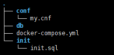

### docker在ubuntu上安装(阿里云)
[帮助文档](https://help.aliyun.com/document_detail/60742.html?spm=5176.11065259.1996646101.searchclickresult.7068232c55MgRH)
```
# step 1: 安装必要的一些系统工具
apt-get update
apt-get -y install apt-transport-https ca-certificates curl software-properties-common
# step 2: 安装GPG证书
curl -fsSL http://mirrors.aliyun.com/docker-ce/linux/ubuntu/gpg | sudo apt-key add -
# Step 3: 写入软件源信息
add-apt-repository "deb [arch=amd64] http://mirrors.aliyun.com/docker-ce/linux/ubuntu $(lsb_release -cs) stable"
# Step 4: 更新并安装Docker-CE
apt-get -y update
apt-get -y install docker-ce
# 安装指定版本的Docker-CE:
# Step 1: 查找Docker-CE的版本:
# apt-cache madison docker-ce
#   docker-ce | 17.03.1~ce-0~ubuntu-xenial | http://mirrors.aliyun.com/docker-ce/linux/ubuntu xenial/stable amd64 Packages
#   docker-ce | 17.03.0~ce-0~ubuntu-xenial | http://mirrors.aliyun.com/docker-ce/linux/ubuntu xenial/stable amd64 Packages
# Step 2: 安装指定版本的Docker-CE: (VERSION例如上面的17.03.1~ce-0~ubuntu-xenial)
# sudo apt-get -y install docker-ce=[VERSION]
```
### 直接官网安装
```
# 安装
wget -qO- https://get.docker.com | sh
# 设置当前用户访问docker
sudo usermod -aG docker username
```
### 配置加速
[配置加速网站](https://cr.console.aliyun.com/?spm=a2c4g.11186623.2.3.axVfuB#/accelerator)
```
mkdir -p /etc/docker
tee /etc/docker/daemon.json <<-'EOF'
{
  "registry-mirrors": ["https://q8xi3jay.mirror.aliyuncs.com"]
}
EOF
systemctl daemon-reload
systemctl restart docker
```
### 安装docker-compose
```
# 需要自己github上查找最新版本版本号替换
# 官网安装方法 很慢
curl -L https://github.com/docker/compose/releases/download/1.25.0-rc2/docker-compose-`uname -s`-`uname -m` -o /usr/local/bin/docker-compose
# DaoCloud安装 速度很快
curl -L https://get.daocloud.io/docker/compose/releases/download/1.25.0-rc2/docker-compose-`uname -s`-`uname -m` > /usr/local/bin/docker-compose
# 授权
chmod +x /usr/local/bin/docker-compose
# 检查版本
docker-compose --version
```
### 使用docker-compose构建springboot项目
把springboot可执行jar包+mysql初始化环境构建为docker镜像,目录结构如下(资源文件在docker目录下):  
  
直接执行如下命令构建镜像并启动  
```  docker-compose up -d ```  
测试请求:  
``` 
req: curl localhost:8080 
out: 首页面啊 

req: curl localhost:8080/db
out: [{"id":1,"username":"zhangsan","email":"test12345@qq.com","password_hash":"passwd","avatar":"avaterpath"},{"id":2,"username":"lisi","email":"12345test@qq.com","password_hash":"passwd","avatar":"avaterpath"}]
```